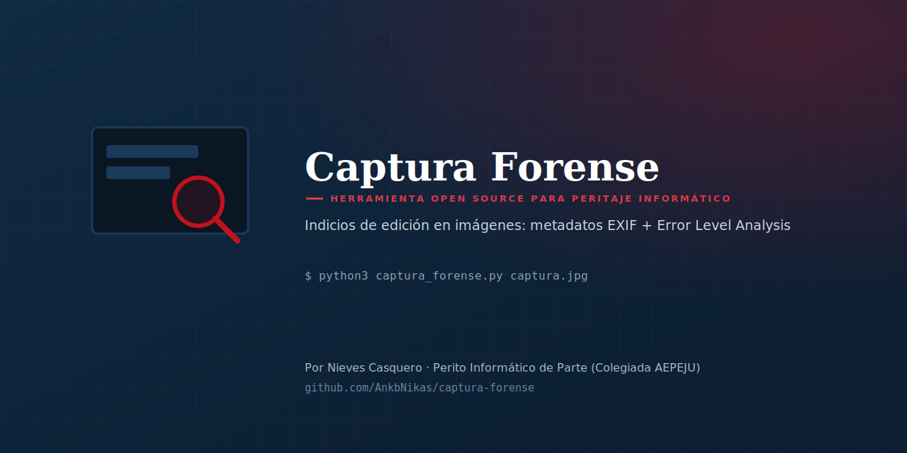
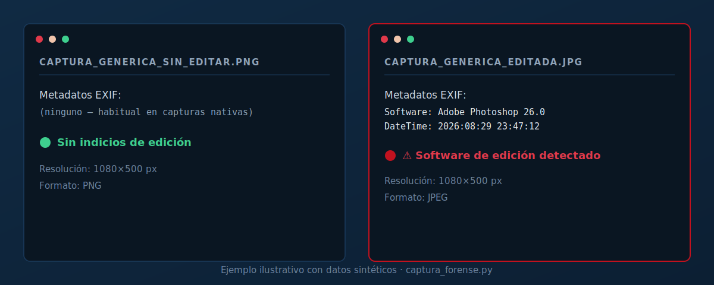

<p align="center">
  
</p>

<p align="center">
  
  
  
</p>

# Captura Forense

Herramienta de línea de comandos que analiza una imagen (una captura de pantalla, una foto, un documento escaneado) y genera **indicios técnicos orientativos** sobre una posible edición: metadatos EXIF, plausibilidad como captura de pantalla nativa, y un mapa de **Error Level Analysis (ELA)**.

Pensada para **peritos informáticos, abogados y equipos de compliance** que reciben capturas de pantalla como prueba (WhatsApp, redes sociales, correos) y necesitan un primer análisis técnico antes de decidir si procede un peritaje completo.

## ¿Por qué existe esta herramienta?

Las capturas de pantalla son, con diferencia, el tipo de evidencia digital más habitual en disputas civiles, laborales y de acoso — y también una de las más fáciles de falsificar con cualquier editor de imagen. Los despachos de peritaje informático ofrecen como servicio de pago la "certificación de capturas de pantalla" mediante ELA y análisis de metadatos. No existía, hasta ahora, una herramienta open source accesible en español para hacer un primer análisis de este tipo.

Esta herramienta **no sustituye ese peritaje profesional** — automatiza el primer análisis técnico (metadatos + ELA) para que un perito, abogado o particular pueda hacerse una idea inicial antes de encargar un informe pericial completo.

## Ejemplo

<p align="center">
  
</p>

## Características

- 🔍 Extracción de **metadatos EXIF** (software usado, fecha, cámara, GPS si existe)
- ⚠️ Detección de **rastros de editores de imagen** conocidos (Photoshop, GIMP, Snapseed, Lightroom, Canva...) en los metadatos
- 📐 Comprobación de si la resolución coincide con **pantallas de dispositivos habituales** (o si es sospechosamente distinta)
- 🌡️ **Error Level Analysis (ELA)**: genera un mapa de calor que resalta regiones con un historial de compresión distinto al resto de la imagen
- 📄 Informe en Markdown + datos estructurados en JSON
- ✅ Una única dependencia externa: **Pillow**

## Instalación

```bash
git clone https://github.com/AnkbNikas/captura-forense.git
cd captura-forense
pip install Pillow
```

## Uso

```bash
python3 captura_forense.py captura.jpg

# Ajustando la sensibilidad del ELA
python3 captura_forense.py captura.jpg --calidad 85 --amplificacion 20 --salida informe_caso3
```

| Fichero generado | Contenido |
|---|---|
| `informe_captura.md` | Informe legible con metadatos, plausibilidad y análisis ELA |
| `informe_captura_ela.png` | Mapa de calor ELA |
| `informe_captura.json` | Datos estructurados para integraciones |

## Cómo interpretar el ELA

En una imagen JPEG sin edición posterior, el nivel de error de recompresión suele ser homogéneo. Una región que destaca claramente del resto (más brillante **o** anómalamente más plana que su entorno) es un indicio de que esa zona tiene un historial de compresión distinto — compatible con un pegado, una edición localizada o una re-compresión parcial. **No es una prueba definitiva**: el texto, los bordes muy marcados y las imágenes ya reconvertidas varias veces pueden generar falsos positivos. Interprétese siempre junto con el resto de indicios.

## ⚖️ Límites y buenas prácticas — lectura obligatoria

- Esta herramienta genera **indicios técnicos**, no una certificación de autenticidad. El resultado debe ser interpretado por un profesional y, si va a usarse en un procedimiento judicial, incorporado a un **informe pericial completo y firmado**.
- Una captura de pantalla, **incluso sin ningún indicio de edición**, sigue rompiendo la trazabilidad respecto a la fuente original. Siempre que sea posible, es preferible acreditar el contenido desde su origen: extracción forense del dispositivo, cabeceras de correo originales, etc.
- El ELA tiene **falsos positivos y falsos negativos** conocidos. No lo uses como única base para afirmar que una imagen es falsa o auténtica.
- Ausencia de indicios ≠ prueba de autenticidad. Presencia de indicios ≠ prueba de manipulación. Son señales que orientan, no un veredicto.

## Hoja de ruta

- [ ] Detección de doble compresión JPEG (análisis de tablas de cuantización)
- [ ] Comparación de varias imágenes de un mismo hilo/conversación
- [ ] Exportación del informe en PDF

## Licencia

MIT — ver [LICENSE](./LICENSE).

## Autora

**Nieves Casquero** — Perito Informático de Parte (Colegiada AEPEJU), Especialista en Ciberseguridad y Pentester

- GitHub: [@AnkbNikas](https://github.com/AnkbNikas)
- Web: [nievescasquero.github.io](https://nievescasquero.github.io)
- LinkedIn: [nieves-kaskero](https://www.linkedin.com/in/nieves-kaskero/)

Si te resulta útil, una ⭐ en el repositorio ayuda a que llegue a más gente del sector.
